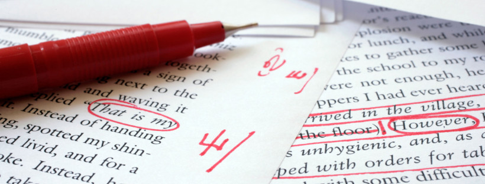

Brujitos, brujitas y brujites, _welcome_! ✨

Hace un par de semanas (bueno, vale, quizá más cerca del mes) escribí una entrada sobre la [corrección de estilo](https://aliciaroma.es/blog/correccion-de-estilo/), y hoy quiero hablar sobre otro tipo de corrección: la ortotipográfica.

A grandes rasgos, y como su propio nombre indica, este tipo de corrección **se centra en la ortografía, la gramática y la ortotipografía del texto**. Se identifican y editan aquellas palabras escritas de forma errónea en un texto, erratas, errores tipográficos, de acentuación o puntuación y, en general, todos aquellos minidetalles que han pasado inadvertidos. 

¿Y por qué se producen estos errores? Por multitud de factores como pueden ser: lapsus, cansancio, prisas por terminar el capítulo, tener la mente focalizada en la historia y, en ocasiones, simple desconocimiento de algunas normas gramaticales.

Después de trabajar un tiempo como correctora, puedo asegurar que los errores más comunes que me he encontrado han sido: la sustitución de una letra por otra cercana en el teclado, dobles espacios, omisión de algunas palabras que llevan tilde y viceversa, errores en la puntuación de los diálogos (sobre este tema haré una entrada propia), guiones para unir prefijos a los sustantivos y colocación de espacios tras los puntos finales de un párrafo.

«Pero, Alicia, no lo entiendo bien. Si en la entrada de la corrección de estilo nos dijiste que lo primero que se hace es corregir los errores gramaticales, ortográficos, de léxico y de sintaxis, ¿no es eso lo mismo que hace este tipo de corrector?» La respuesta sí con un **no** más grande. Sí, el corrector de estilo tiene en cuenta la gramática del texto y todos los aspectos que toca el corrector ortotipográfico con una gran diferencia: mientras que el de estilo se centra más en el contenido general del texto y cómo adecuarlo al autor y sus lectores, **el ortotipográfico va letra por letra, carácter por carácter, signo por signo, detectando posibles erratas, errores y detalles** que el corrector de estilo ha podido pasar por alto como, por ejemplo, un doble espacio o tres puntos en lugar del caracter de puntos suspensivos.

El corrector ortotipográfico modifica muchas cosas del texto que, además, suelen pasar desapercibidas hasta para el propio autor. 

Antes de continuar desgranando en detalle la labor que hacemos como correctores, quiero destacar que **es una labor humana irremplazable**. A día de hoy no existe un programa o _app_ capaz de revisar todos los aspectos formales de un texto. Por poner un par de ejemplos: ¿vuestro editor de textos detecta la diferencia entre «aun» y «aún»? ¿Ha reconocido como erróneo un cambio de «s» y «d» como en «de sentó»?

## ¿Qué se hace en una corrección ortotipográfica?

La ortotipografía se ocupa del **control de la calidad del texto aplicando los principios tipográficos de estética, legibilidad y eficacia** en un texto escrito. Para ello, se corrigen obras ya escritas o maquetadas según un diseño determinado.

Las normas por las que se rige la ortotipografía se desarrollaron en el mundo del impreso y, a día de hoy, no hay un único criterio que seguir. Estas normas cambian dependiendo de factores como la lengua que se utilice, el formato de la publicación, los distintos medios de comunicación, las diferentes editoriales, etc. Por tanto, al existir una gran disparidad de criterios, como correctores siempre debemos **saber qué pautas utiliza nuestro cliente** para adecuarnos a sus estándares.

A grandes rasgos, y sabiendo que no seré capaz de enumerar todos, los correctores ortotipográficos nos encargamos de:

*   **Corregir los errores ortográficos, sintácticos y gramaticales**. Esto incluye falta de concordancia entre sujeto y verbo, omisión de tildes, preposiciones mal colocadas, erratas y un largo etcétera.
*   **Omisión o transposición de caracteres**. Esto ocurre muchísimo cuando se escribe rápido y es difícil de ver al revisar el texto.
*   **Revisar el uso inapropiado o incoherente de los recursos tipográficos**. Estos son: comillas, cursivas, subrayado, numeración, símbolos, negritas, superíndice, subíndice y versalitas, entre otros.
*   **Corregir errores de acentuación, abreviaturas, símbolos y escritura de cifras**. La mayoría de estos errores vienen por desconocimiento de la norma o por puro despiste del autor o autora.
*   **Solventar la aplicación incorrecta de mayúsculas**. Uno de los trucos no oficiales para saber si va con mayúscula o no es: ante la duda, minúscula. Se cumple en el 90% de los casos aunque, como profesionales que somos, siempre lo revisamos.
*   **Revisar y corregir la puntuación**. En especial el uso de la coma, el punto, los dos puntos, los puntos suspensivos, los incisos y, en novela, los diálogos.
*   **Unificar criterios**. Este punto es especialmente importante en aquellas cuestiones no sujetas a una normativa concreta, como es el uso de negrita, cursiva y comillas.
*   **Ajustar la ortografía a las normas de la RAE**. Estemos de acuerdo o no con algunas cuestiones, los correctores siempre vamos a corregir en función de los criterios de la RAE.

Cuando la corrección se realice sobre el texto ya maquetado para versión impresa, trabajamos sobre papel y trabajamos detectando una serie de detalles tales como:

*   **Viudas y huérfanas**. Son líneas que, al quedar en una página distinta que el resto del párrafo al que pertenecen, aparecen aisladas de su contexto. 
*   **Repetición de texto idéntico**, tanto en líneas seguidas como en el mismo lugar de la frase. Se marca cuando coinciden más de dos caracteres.
*   **Partición incorrecta de palabras a final de línea**. Poco más que añadir a esta frase.
*   **Blancos, márgenes y sangrías**. Unificar la medida de las sangrías, revisar los márgenes y controlar los blancos generales de la página.
*   **Numeración de páginas**. Aunque la lógica dice que no debería existir error en este aspecto, lo cierto es que, a veces, se puede saltar algún número o, simplemente, no aparecer en la página.

Hay algunos elementos que también son competencia de los correctores ortotipográficos pero, debido a su dificultad, siempre deben **acordarse previamente con el cliente**. Hablo de la **elaboración del índice** con su correspondiente paginación y la **revisión de la bibliografía** y unificación de sus criterios.

## ¿En qué nos fijamos en una corrección ortotipográfica?

José Martínez de Sousa define la ortotipografía como «el conjunto de reglas de estética y escritura tipográfica que se aplican a la presentación de los elementos gráficos, como bibliografías, cuadros, poesías, índices, notas de pie de página, citas, citas bibliográficas, obras teatrales, aplicación de los distintos estilos de letra (redonda, cursiva, versalita, así como las combinaciones de unas y otras), etc.».

Como veis, Sousa habla sobre multitud de aspectos en un texto y ha llegado el temido momento de intentar enumerar todo aquello que tenemos en cuenta en un texto. Intentaré no dejar nada fuera, aunque es misión imposible:

*   **Todos y cada uno de los caracteres del texto**. Esto incluye los espacios, los símbolos y las letras, así como sus variantes: redonda, cursiva, negrita, versalita, subíndice y superíndice, ancha y estrecha, etc. Asimismo, entran dentro de este grupo los recursos tipográficos, mayúsculas, abreviaturas, siglas, símbolos y cifras. 
*   **Puntuación**. Se realiza una revisión de la puntuación de todos y cada uno de los elementos textuales y extratextuales como gráficas, cuadros, notas al margen, textos de pie de foto o figura…
*   **Espacios y blancos**. Cuenta con todos los espacios y blanco que aparecen en la página: sangrías, espaciado, líneas de blanco, corondeles, espacio fino o doble, etc.
*   **Jerarquía de títulos**. Los títulos, apartados y subapartados deben tener una composición y estilo concreto que debe estar unificado a lo largo de toda la publicación.
*   **Alineación** de los elementos del texto.
*   **Orden y numeración**. Los elementos deben seguir el mismo formato y estar numerados correctamente.
*   **División y separación de palabras**.
*   **Citas**. Unificar las citas según el sistema que elija el cliente, que suele ser siguiendo la normativa APA o el sistema Harvard.
*   **Notas**. Incluye tanto las notas al pie de foto o figura como las notas al pie de página.
*   **Índices**. Revisar que todos siguen el mismo formato y comprobar que la numeración se corresponde con el número de página.
*   **Bibliografías**. Se debe comprobar que todo lo que aparece en la bibliografía aparece en el propio texto y revisar que, efectivamente, la cita remite a la bibliografía correcta. Además, se debe unificar según el criterio establecido por el cliente, que puede ser: mediante notas al pie de página, siguiendo las normas APA o según el sistema Harvard de citas bibliográficas.

Como veis, los correctores y las correctoras de ortotipografía nos fijamos en todos esos detalles que pueden pasar desapercibidos y que, sin que nos demos cuenta, estropean completamente un texto.

Quiero finalizar el post de hoy con una frase de [Mariana Eguaras](https://marianaeguaras.com/) que resume muy bien la esencia de este _post_ y la importancia de nuestro trabajo en el mundo editorial: **«Una corrección de estilo siempre es recomendable y una corrección ortotipográfica es imprescindible».**

¡Hasta la próxima, _wizards_! 🧙‍♀️
